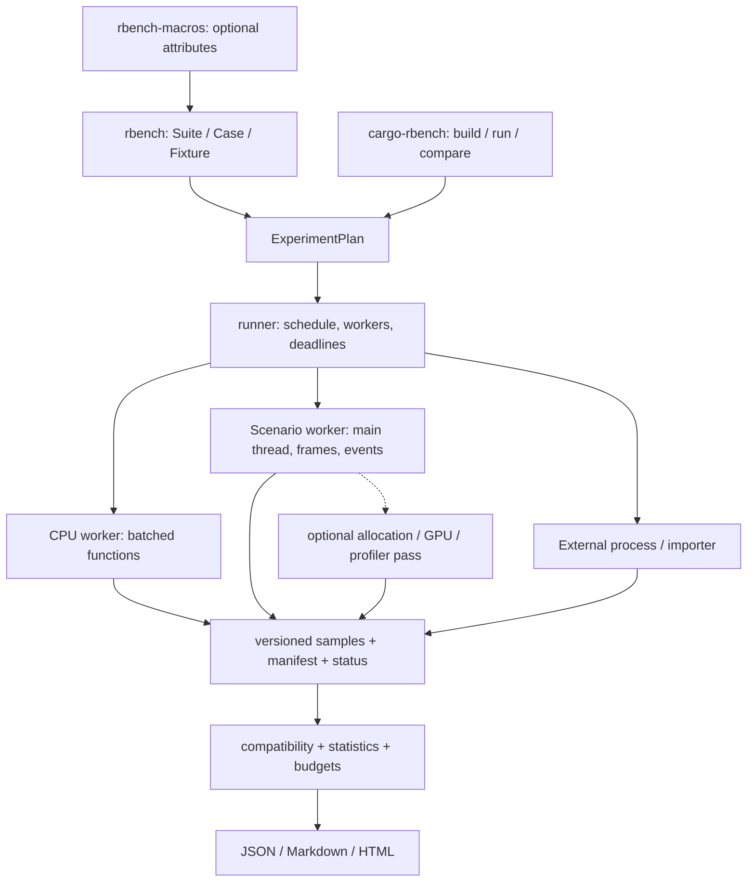

# Архитектура rbench

Статус: реализованный каркас 0.1.0 + hardening (process metrics, atomic publish, acceptance). Документ сохраняет целевые границы; сверяйте с кодом crates/rbench и docs/VALIDATION.md. Основной выбор — небольшая Rust-библиотека описания экспериментов, независимый runner и общий протокол для microbenchmark, процессов и сценариев приложения. Первый целевой потребитель — Forma.

## Компоненты



Предлагаемые границы модулей/пакетов:

| Компонент | Ответственность | Чего не должен знать |
|---|---|---|
| `rbench-model` | CaseId, MetricDescriptor, phase, observations, manifest, status, protocol version | wgpu, GUI, конкретный async runtime |
| `rbench` | Suite builder, fixture lifetime, типизированный горячий loop, black_box helpers | Хранилище истории, HTML, внешние процессы |
| `rbench-runner` | Worker lifecycle, deterministic schedule, cancellation, timeout, resource leases | Формула «FPS» конкретного renderer |
| `rbench-analysis` | Валидация совместимости, статистика, budgets, диагностические статусы | Запуск измеряемого кода |
| `cargo-rbench` | Cargo discovery/build, CLI, пути артефактов, запуск заранее собранных workers | Внутренности Forma |
| `rbench-macros` | Необязательный синтаксический сахар над тем же builder API | Особый второй execution path |
| Опциональные адаптеры | Tokio, wgpu, alloc, process metrics, browser, Forma import | Не должны расширять обязательные зависимости ядра |
| `rbench::process` | OS RSS/CPU вне timed batches | GPU bytes, hot-loop sampling |
| `rbench::publish` | temp+fsync+rename артефактов и recover incomplete runs | Семантика workload |
| `rbench::acceptance` | Synthetic coverage / A/A probes | Утверждения о production FPR |

Не создавать десяток пустых crates сразу. В первой реализации достаточно model, library, runner/CLI и analysis; адаптеры выделять по реальным несовместимым зависимостям. `wgpu 29` Forma не должен навязывать ту же версию другим проектам.

## Два уровня расширения

**Горячий путь:** generic Rust function/closure и специализированный цикл; без JSON, Box<dyn> на каждый вызов, логирования или регистрации внутри замера. Dynamic dispatch допустим на границе case/batch, если стоимость измерена и описана. `black_box` предотвращает часть оптимизаций, но не доказывает эквивалентность полезной работы.

**Управляющий путь:** versioned сообщения между runner и executable. Протокол позволяет запустить старую и новую версии разных зависимостей без общей Rust ABI. Discovery возвращает descriptors; большие datasets передаются через path + content hash, не сериализуются на каждый sample.

Пример управляющих команд: `hello`, `list`, `prepare`, `validate`, `warmup`, `sample_batch`, `finish`, `cancel`. Worker объявляет возможности; неизвестная обязательная возможность завершает preflight конкретной причиной. Stdout/stderr пользовательского кода — отдельные артефакты, transport использует отдельный канал. Серилизация batch — после остановки часов.

## Lifecycle

`Created → Prepared → Validated → Calibrated → Warmed → Measured → Finalized`.

Каждый этап может завершиться `Failed`, `TimedOut`, `Cancelled`, `Unavailable`; обрыв процесса оставляет incomplete run. Finalize вызывается по возможности, но исходная ошибка не теряется при сбое cleanup. Panic не превращается в sample со временем 0. `panic=abort` требует внешнего supervisor.

Runner заранее строит и сохраняет schedule. Compile выполняется до измерительной фазы; A/B бинарники и fixtures хешируются до и после серии. Результат публикуется атомарно только при полном required case set; частичные данные остаются доступны для диагностики.

Для CPU microbench по умолчанию один измеряемый worker в каждый момент; для независимых replications — новые процессы. Для concurrency workload параллелизм является параметром самого сценария. GPU/window jobs получают exclusive lease по adapter/display. Локальная блокировка координирует только rbench: она не гарантирует отсутствие чужой нагрузки.

## Три execution driver

1. **Micro:** много операций в batch; calibrated iteration count; явный setup/reset/drop. Результат — длительность batch и число операций, не individual latency.
2. **Process:** spawn готовой программы с argv/env/cwd; отдельно startup-inclusive wall time и внутренние метрики, если программа поддерживает protocol/import. Нельзя вычитать launch cost из startup benchmark.
3. **Scenario:** приложение само владеет main thread/event loop. Driver сообщает readiness, phase boundaries, tick/frame/event completion. Runner не вкладывает winit loop в background thread и не заставляет приложение синхронно ждать GPU на каждом кадре.

Browser/WASM — будущий scenario driver через внешний host. Внутри wasm нет предположения о spawn процесса, Unix APIs или обычном native timer.

## API — эскиз

```rust,ignore
// Предлагаемый синтаксис; ещё не доступная библиотека.
let mut suite = Suite::new("tokenizer");
suite.case("json/parse")
    .param("dataset", "unicode")
    .fixture_hash(dataset_sha)
    .throughput(Throughput::Bytes(input.len() as u64))
    .validate(|| validate_parse(&input))
    .bench(|b| b.iter(|| parse(std::hint::black_box(&input))));

suite.case("sort")
    .fixture(|| make_unsorted(seed))
    .reset(Reset::EveryOperation)
    .drop_policy(DropPolicy::OutsideTiming)
    .batch_memory_limit(16 * MIB)
    .bench_with_input(|b, input| b.iter_mut(input, |v| v.sort()));
```

Перед фиксацией API второй пример нужно проверить на mutable fixtures: библиотека не должна случайно сортировать уже отсортированный массив и не должна хранить бесконечный Vec результатов ради исключения Drop. Разные `EveryOperation/EveryBatch/EveryProcess` имеют разную семантику и часть case contract.

Для Forma предпочтителен отдельный `Scenario` trait, а не попытка выразить окно через `b.iter(|| render())`. Пусть приложение передаёт observations `cpu_submit`, `completed_frame`, `gpu_pass`, `present_interval` и self-validation; recorder не определяет за него момент окончания работы.

## Хранилище

```text
run-id/
  manifest.json          # toolchain, binary/fixture hashes, plan, environment
  status.json            # running/complete/failed + reason
  schedule.json          # порядок, seeds, pair/process IDs
  cases/<case-id>/
    observations.jsonl   # ordered samples, phase, metric ID, units
    diagnostics.jsonl    # environment changes, unavailable reasons
    stdout.log
    stderr.log
  artifacts/             # profiles, image diffs; content-addressed references
  analysis.json          # analysis version + config + hashes of raw data
  REPORT.md
```

Данные append-only; анализ можно повторить без нового исполнения. Baseline — ссылка на неизменяемый complete run, не перезаписываемый `latest.json`. Crash recovery помечает оборванный run; дописывание после паузы создаёт новую session/block, а не притворяется непрерывным экспериментом.

JSON числа счётчиков могут превысить точность JS: wire format для больших integer counters — decimal string либо ограничение с явной проверкой. Внутри Rust используются целочисленные ticks/counts/bytes и проверяемая арифметика; f64 появляется в статистике и представлении. Версия схемы обязательна, неизвестные расширения можно сохранить, неизвестную семантику единиц нельзя сравнивать автоматически.

## Решения и отвергнутые альтернативы

| Решение | Почему | Альтернатива и цена |
|---|---|---|
| Собственная model/protocol, а не wrapper Criterion | Forma требует нескольких phase-bound метрик и событийного loop | Wrapper быстрее для CPU-only, но его модель не покрывает цель целиком |
| Processes, не динамически загружаемые Rust библиотеки | Сравнение разных commit/dependency graphs, crash containment | IPC имеет overhead; устраняется крупными batches, не shared-memory с первого дня |
| `Instant` как первый native clock | Понятная переносимая семантика | TSC/counter clock — отдельный проверяемый backend; не гарантировать универсальные наносекунды |
| Раздельные measurement/diagnostic passes | Instrumentation меняет код и timing | Одновременные метрики допустимы, когда нужны корреляции, но режим фиксируется в manifest |
| Generic allocator wrapper с явным подключением пользователем | В программе допустим один global allocator, у пользователя может быть свой | Автоматически подменять allocator нельзя |
| Offline files перед сервером | Проверяемость и минимум установки | Dashboard/history добавляются поверх того же протокола |
| Public model extensible, engine internals private | Не замораживать sampling internals первым релизом | Плагины получают ограниченный versioned contract |
